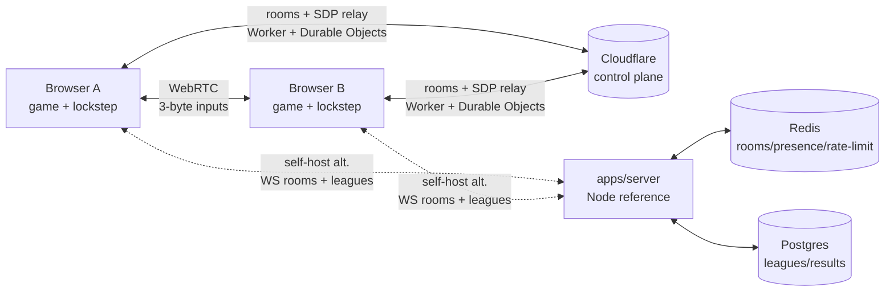

## HNC League — play for your country

The country lobby has one primary action: **Play for your country**. Cloudflare
matchmaking pairs two players representing different countries, then starts a
1v1 human match with full national teams and country-colored kits. Games have
two 60-second halves. Wins add 3 points and draws add 1 to the weekly world table;
both players must report matching scores. Country selection is locked weekly.

Country matches use a reserved Cloudflare WebSocket relay, with profiles and
results in D1. Friend challenges are also available through the secondary menu.
Same-country friend matches do not award country points.

# Floodlight Football — open-source arcade football

11v11 browser football (Three.js + deterministic sim), local AI, P2P online,
touch + PWA. MIT licensed. The immediacy of HaxBall, a full team each, in a
polished 3D presentation — not a FIFA clone.



```text
                        Cloudflare
                 Worker + Static Assets
                         │
                  Durable Objects
               rooms · signaling
                         │
             ┌───────────┴───────────┐
             │                       │
         Browser A               Browser B
             │                       │
             └──── WebRTC P2P ───────┘
                         │
                 deterministic
                    lockstep
```

Solo needs no backend. Online rooms are coordinated by the Cloudflare
control plane; match traffic stays peer-to-peer. The Node server remains as
the self-hosted reference backend (rooms + leagues over WS/REST).

Solo play works with no backend. Online room codes are
coordinated by the Cloudflare control plane (Worker + Durable Object rooms,
same origin as the game); rooms are ephemeral (~2 h TTL) and match traffic
stays WebRTC P2P — no Redis or login is involved. City League results,
profiles and standings persist in Cloudflare D1 (`players`/`matches`/
`submissions` only); solo/AI never touches it. The game falls back to the
Node WS protocol automatically when the page is served next to Node instead
of Cloudflare (Docker self-host). Docker is never required by the
Cloudflare path.

## Interesting engineering problems

- Deterministic fixed-step (60 Hz) simulation: seeded RNG, serial iteration,
  snapshots, FNV-1a state hashes (`apps/game/src/engine.ts`, `game/`).
- P2P WebRTC lockstep: 3-byte inputs/tick, hash cadence, snapshot resync,
  drop-to-AI recovery (`apps/game/src/net/`).
- State hashing/resynchronization across peers (same seed + inputs ⇒ same hash).
- Three.js rendering: broadcast/tactical/close-up cameras, cinematics,
  celebration poses — camera-only, never touches the sim (`render/`).
- Desktop/mobile unified input: arrows + analog stick merge to one
  `InputFrame` namespace (`input/`).
- Deterministic AI (carrier/support/chase/mark/keeper), all inside the sim.
- Shared network protocol: zod WS + REST contracts, single source of truth
  (`packages/protocol/`); the Cloudflare Worker validates the same shapes
  without importing Node modules.
- Cloudflare control plane: Worker + per-room Durable Objects (SQLite,
  WebSocket hibernation, ~2 h TTL alarms), same origin as the game
  (`apps/game/worker/`); data plane stays WebRTC P2P.
- Redis-backed ephemeral rooms (TTL, presence, rate limits) with a memory
  adapter for dev/tests — Node reference backend only, never Cloudflare.
- Postgres/Drizzle persistent league data (fixtures, dual-submit results,
  standings) with a memory adapter for dev/tests.
- Dockerized self-host stack (Caddy + server + Redis + Postgres) with local
  parity; Cloudflare Workers Static Assets for the game itself.

## Quickstart

```sh
npm install
npm test                                   # all workspaces
npm run dev:game                           # game + Worker + local DOs (http://127.0.0.1:5173)
npm run dev:server                         # Node reference backend (ws://127.0.0.1:8080/socket)
REDIS_URL=redis://localhost:6379 npm run dev:server   # Redis store
npm run build --workspace=floodlight-football         # client + Worker bundle
npm run deploy                             # build + wrangler deploy to Cloudflare
docker compose up -d                       # self-host topology (reference backend)
```

Backend-optional: solo (`PLAY MATCH`, `DAILY CUP`) never needs a server.
`ONLINE MATCH → PLAY WITH A FRIEND` creates a Cloudflare room and shows a
grouped 6-letter code for `JOIN WITH CODE` — no links, no SDP copy-paste, no
server URL to configure. The control plane reports connection problems with
player-friendly messages; solo keeps working.
Leagues need the Node reference server.

Status: solo + 1v1 lockstep live. League REST is implemented server-side; the
in-game league menu is gated `COMING SOON` until hosted. No 2v2 yet — the
input boundary (`one controller → one InputFrame`) is kept 2v2-compatible by
design (see `docs/architecture.md`).

## Layout

| Path | What |
|---|---|
| `apps/game/` | Vite + Three.js client, deterministic sim, netcode (`src/net/`), input (`src/input/`), cameras (`src/render/`), Cloudflare control plane (`worker/`) |
| `apps/server/` | Self-hosted/reference backend: signaling + rooms + leagues (`src/server.ts`, `src/leagues/`, `src/db/`) — not the production path |
| `packages/protocol/` | Shared zod schemas: WS messages, REST DTOs — single source of truth |
| `docs/architecture.md` | Client/sim/render/input/net/control-plane/reference-backend/Redis/Postgres/deployment/2v2 |
| `docs/deployment.md` | Cloudflare production vs Node/self-host reference |
| `docs/gameplay-known-issues.md` | Frozen gameplay feel issues, reserved for the specialist pass |
| `docs/adr/` | Architecture decision records (start here for *why*) |
| `work/` | Session tuning notes |

Decisions: [P2P + thin backend](docs/adr/001-p2p-thin-backend.md) ·
[no Kubernetes](docs/adr/002-no-kubernetes.md) ·
[Postgres + Redis](docs/adr/003-postgres-redis.md) ·
[guest + dual-submit](docs/adr/004-guest-dual-submit.md) ·
[Cloudflare control plane + P2P data plane](docs/adr/005-cloudflare-control-plane.md)

## Contributing

- Conventional commits (`feat:`, `fix:`, `docs:` …), feature branches, PRs need green CI.
- Every behavior change ships with a headless test (`tsx --test`, no DOM/WebGL needed).
- `npm test && npm run build --workspaces --if-present` before pushing.

Country matchmaking fills an empty search after roughly 8–10 seconds with a computer-controlled country opponent, disclosed in the lobby. Completed matches submit an input replay for server verification before both countries receive normal league points. No background bot matches are generated. Play with a Friend creates a shareable room directly; friends can also join with a code.
