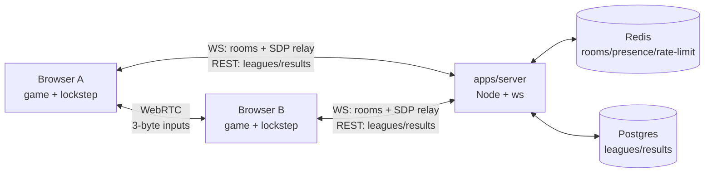

# Floodlight Football — open-source arcade football

11v11 browser football (Three.js + deterministic sim), local AI, P2P online,
touch + PWA. MIT licensed. The immediacy of HaxBall, a full team each, in a
polished 3D presentation — not a FIFA clone.



```text
                  Browser Game
              TypeScript + Three.js
                       │
            deterministic simulation
                       │
             WebRTC lockstep match
                  ↙           ↘
              Player A       Player B

              optional signaling
                       │
                  Backend
             rooms / leagues
                ↙         ↘
             Redis      PostgreSQL
```

Solo and serverless-invite play work with no backend. Room codes and leagues
need the Node server; a future Cloudflare-native path (Worker + Durable
Object + D1) can replace Node room coordination while preserving the
protocol/domain model. Docker is never required by the Cloudflare path.

## Interesting engineering problems

- Deterministic fixed-step (60 Hz) simulation: seeded RNG, serial iteration,
  snapshots, FNV-1a state hashes (`apps/game/src/engine.ts`, `game/`).
- P2P WebRTC lockstep: 3-byte inputs/tick, hash cadence, snapshot resync,
  drop-to-AI recovery (`apps/game/src/net/`).
- State hashing/resynchronization across peers (same seed + inputs ⇒ same hash).
- Three.js rendering: broadcast/tactical/close-up cameras, cinematics,
  celebration poses — camera-only, never touches the sim (`render/`).
- Desktop/mobile unified input: arrows + analog stick merge to one
  `InputFrame` namespace (`input/`).
- Deterministic AI (carrier/support/chase/mark/keeper), all inside the sim.
- Shared network protocol: zod WS + REST contracts, single source of truth
  (`packages/protocol/`).
- Redis-backed ephemeral rooms (TTL, presence, rate limits) with a memory
  adapter for dev/tests.
- Postgres/Drizzle persistent league data (fixtures, dual-submit results,
  standings) with a memory adapter for dev/tests.
- Dockerized self-host stack (Caddy + server + Redis + Postgres) with local
  parity; Cloudflare Workers static hosting for the game itself.

## Quickstart

```sh
npm install
npm test                                  # all workspaces
npm run dev:game                           # http://127.0.0.1:5173
npm run dev:server                         # ws://127.0.0.1:8080/socket (memory store)
REDIS_URL=redis://localhost:6379 npm run dev:server   # Redis store
npm run build --workspace=floodlight-football         # game dist first
docker compose up -d                       # full topology
```

Backend-optional: solo (`PLAY MATCH`, `DAILY CUP`) and `ONLINE MATCH →
CREATE INVITE LINK` work with no server. Room codes (`CREATE/JOIN ROOM`) and
leagues need the server and report `SERVER UNREACHABLE` clearly when it's down.

Status: solo + 1v1 lockstep live. League REST is implemented server-side; the
in-game league menu is gated `COMING SOON` until hosted. No 2v2 yet — the
input boundary (`one controller → one InputFrame`) is kept 2v2-compatible by
design (see `docs/architecture.md`).

## Layout

| Path | What |
|---|---|
| `apps/game/` | Vite + Three.js client, deterministic sim, netcode (`src/net/`), input (`src/input/`), cameras (`src/render/`) |
| `apps/server/` | Thin signaling + rooms + leagues (`src/server.ts`, `src/leagues/`, `src/db/`) |
| `packages/protocol/` | Shared zod schemas: WS messages, REST DTOs — single source of truth |
| `docs/architecture.md` | Client/sim/render/input/net/backend/Redis/Postgres/deployment/2v2 |
| `docs/deployment.md` | Client-only vs Node/self-host vs future Cloudflare-native |
| `docs/gameplay-known-issues.md` | Frozen gameplay feel issues, reserved for the specialist pass |
| `docs/adr/` | Architecture decision records (start here for *why*) |
| `work/` | Session tuning notes |

Decisions: [P2P + thin backend](docs/adr/001-p2p-thin-backend.md) ·
[no Kubernetes](docs/adr/002-no-kubernetes.md) ·
[Postgres + Redis](docs/adr/003-postgres-redis.md) ·
[guest + dual-submit](docs/adr/004-guest-dual-submit.md)

## Contributing

- Conventional commits (`feat:`, `fix:`, `docs:` …), feature branches, PRs need green CI.
- Every behavior change ships with a headless test (`tsx --test`, no DOM/WebGL needed).
- `npm test && npm run build --workspaces --if-present` before pushing.
