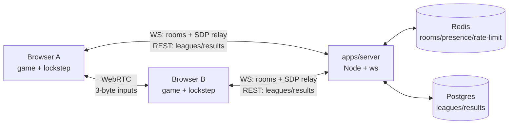

# Floodlight Football — open-source arcade football

11v11 browser football (Three.js + deterministic sim), local AI, P2P online,
touch + PWA. MIT licensed.



## Quickstart

```sh
npm install
npm test                                  # all workspaces
npm run dev:game                           # http://127.0.0.1:5173
npm run dev:server                         # ws://127.0.0.1:8080/socket (memory store)
REDIS_URL=redis://localhost:6379 npm run dev:server   # Redis store
docker compose up -d                       # full topology (needs game build first)
```

## Layout

| Path | What |
|---|---|
| `apps/game/` | Vite + Three.js client, deterministic sim, netcode (`src/net/`) |
| `apps/server/` | Thin signaling + rooms service (F4b adds leagues/results) |
| `packages/protocol/` | Shared zod schemas: WS messages, REST DTOs — single source of truth |
| `docs/adr/` | Architecture decision records (start here for *why*) |
| `work/` | Session tuning notes |

Decisions: [P2P + thin backend](docs/adr/001-p2p-thin-backend.md) ·
[no Kubernetes](docs/adr/002-no-kubernetes.md) ·
[Postgres + Redis](docs/adr/003-postgres-redis.md) ·
[guest + dual-submit](docs/adr/004-guest-dual-submit.md)

## Contributing

- Conventional commits (`feat:`, `fix:`, `docs:` …), feature branches, PRs need green CI.
- Every behavior change ships with a headless test (`tsx --test`, no DOM/WebGL needed).
- `npm test && npm run build --workspaces --if-present` before pushing.
